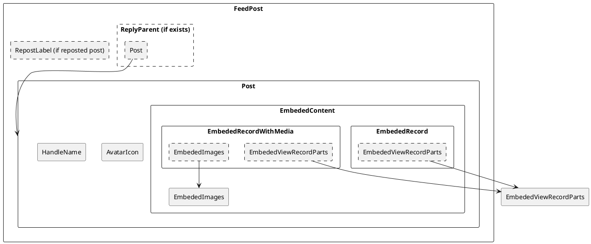

# コンテナ起動・ページ起動方法のメモ

```
docker compose up -d
docker exec -it windtrail /bin/bash
npm run dev
```

# 色定義の生成方法

https://colors.muz.li/ai-color-combination-generator/
上記で生成．

https://goodpalette.io/536b94-e3246a-a9aeb8
その後，上記でセカンダリカラーを生成．

# ポスト表示のコンポーネント構成


